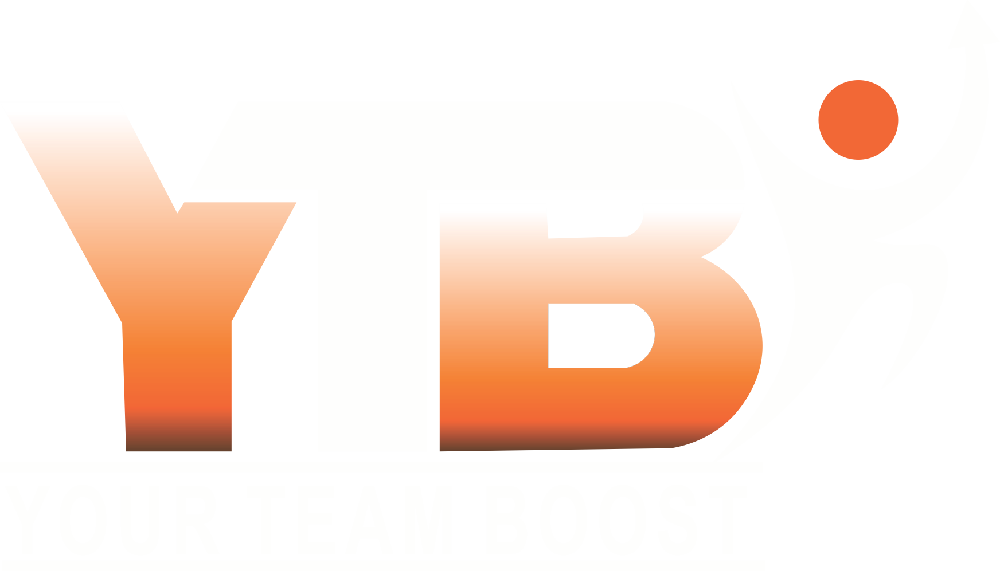
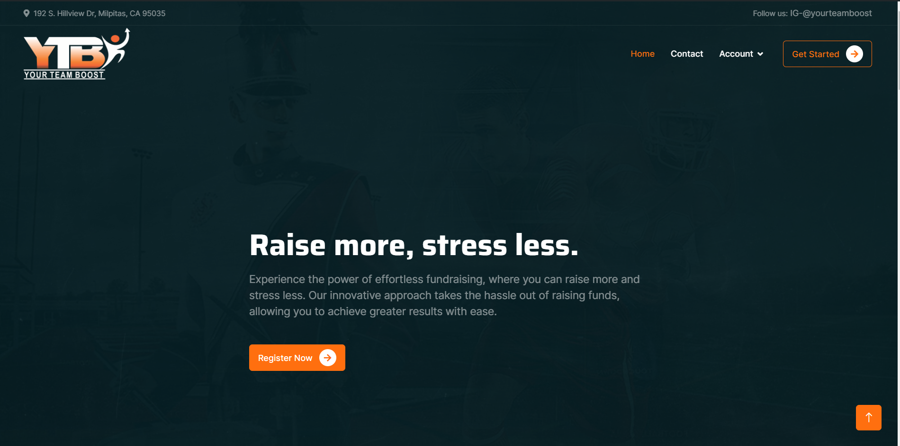
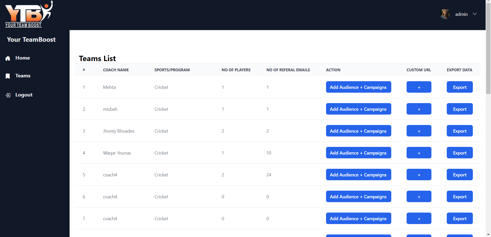
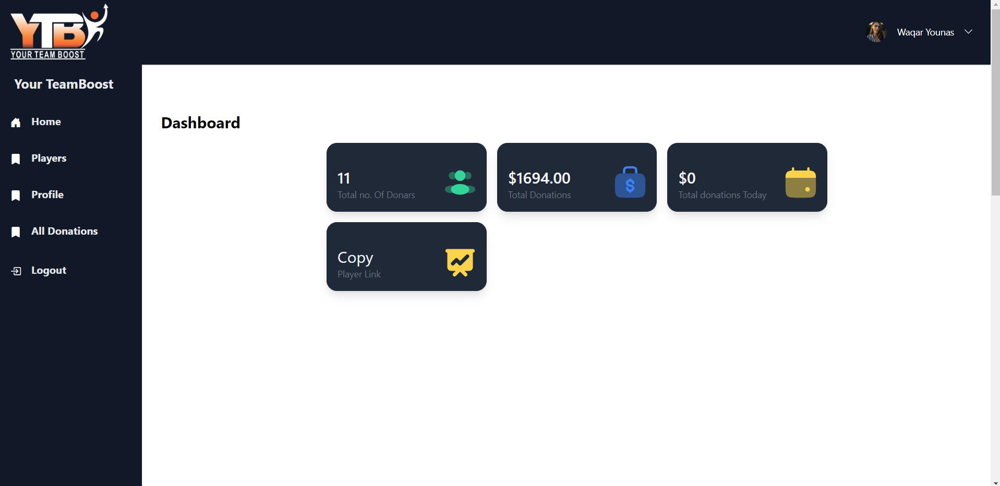
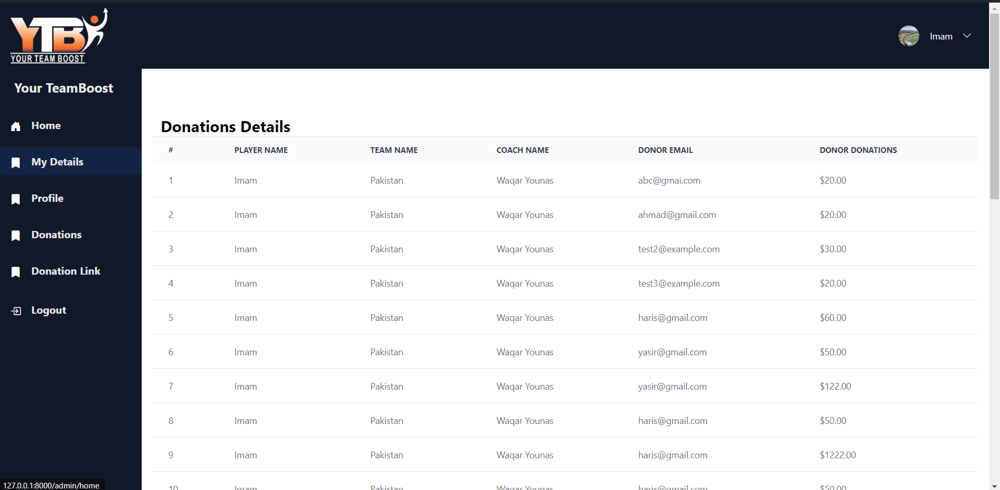

<!-- 

 -->

## About YourTeamBoost

This project is a charity platform tailored for sports teams, enabling coaches to initiate fundraising campaigns by registering themselves on the website. Upon registration, each coach is provided with a unique QR code, which can be scanned by multiple players associated with the team. 

Once scanned, players can register themselves and provide a minimum of 20 referral email addresses. Subsequently, when this process is completed, all referral emails are aggregated. An administrator then gains the ability to commence a campaign from their dashboard, sending out emails to the addresses collected from players, urging recipients to donate to the team's cause.

The dashboard serves as a centralized hub where users, including administrators, coaches, and players, can access specific functionalities pertinent to their roles. This includes viewing campaign progress, managing donations, and accessing links to the team's website for making donations via Stripe, a secure payment processing platform.

Overall, the platform facilitates efficient coordination and execution of fundraising efforts, providing a seamless experience for all stakeholders involved in supporting the team's charitable initiatives.

Laravel is accessible, powerful, and provides tools required for large, robust applications.

## Home

## Admin Dashboard

## Coaches Dashboard

## Player Dashboard

